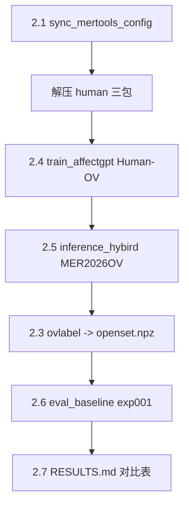

# 阶段 2：官方 Baseline 复现 — 任务计划

> 主文档：[PLAN.md](./PLAN.md) | 配置：[config/baseline.yaml](../config/baseline.yaml)

## 目标

建立可信 AffectGPT baseline，Human-OV val **EW-F1 ≥ 59%**（验收线 ≥ 55%）。

## 前置条件

| 项 | 要求 | 当前 |
|----|------|------|
| 环境 vllm3 | torch + transformers + decord | ✅ |
| 模型 | Qwen + CLIP + HuBERT | ✅ |
| emotion_wheel | wheel_mapping.npz | ✅（阶段 1） |
| Human-OV 媒体 | audio/video/openface 解压 | 🔄 `scripts/extract_human_data.sh` |
| 20k 候选媒体 | candidate zip 全齐 | ⏳ 4 zip 仍缺（推理阶段需要） |
| 阶段 1 评估 | eval_runner / human_ov_val | ✅ |

## 任务分解



| ID | 任务 | 交付物 | 命令 |
|----|------|--------|------|
| 2.1 | 对齐官方 config | `src/training/mertools_paths.py` | `bash scripts/sync_mertools_config.sh` |
| 2.2 | Zero-shot 抽测（可选） | `scripts/zeroshot_smoke.sh` | 需额外 MLLM 权重 |
| 2.3 | ovlabel 两阶段 | `src/inference/openset_extractor.py` | `bash scripts/run_ovlabel.sh --all` |
| 2.4 | AffectGPT 训练 | checkpoint @ `output/.../` | `bash scripts/train_affectgpt.sh human` |
| 2.5 | AffectGPT 推理 | `output/results-mer2026ov/*.npz` | `bash scripts/infer_affectgpt.sh` |
| 2.6 | 评估报告 | `experiments/exp001_baseline/` | `bash scripts/eval_baseline.sh <npz>` |
| 2.7 | 记录 baseline 数字 | `RESULTS.md` + `results.json` | 同上 |

## 一键流程

```bash
# 1. 配置 + 数据
bash scripts/sync_mertools_config.sh
bash scripts/extract_human_data.sh

# 2. 训练（~26h 单卡，60 epoch）
bash scripts/train_affectgpt.sh human

# 3. 推理 + 抽标签 + 评估
bash scripts/infer_baseline.sh

# 或分步：
bash scripts/infer_affectgpt.sh
bash scripts/run_ovlabel.sh --all
bash scripts/eval_baseline.sh path/to/xxx-openset.npz --split val
```

## 验收标准

- [ ] `sync_mertools_config` 无 placeholder `xxx`
- [ ] Human-OV 训练 loss 正常下降，产出 checkpoint
- [ ] 推理产出 reason npz，ovlabel 产出 `-openset.npz`
- [ ] val EW-F1 ≥ 55%（目标 59%）

## 风险

| 风险 | 处理 |
|------|------|
| candidate 数据未齐 | 先训 Human-OV；20k 推理等 zip 完成后再跑 |
| 5090 32GB OOM | batch_size_train=3（与官方一致） |
| RTX 5090 + torch 2.6 cu124 | 报错 `no kernel image is available`；需 PyTorch nightly 或 sm_120 构建，或换 Ampere/Ada GPU |
| 训练耗时长 | 后台 `nohup bash scripts/train_affectgpt.sh human &` |
