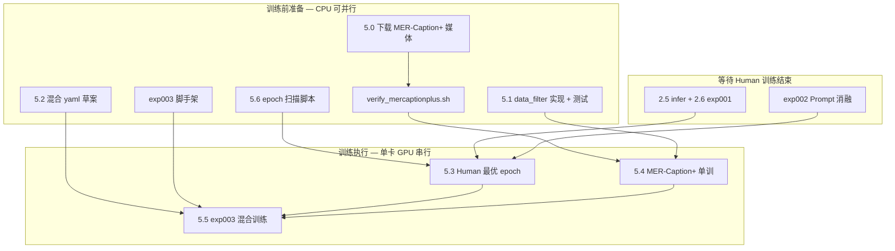

# 阶段 5：AffectGPT 训练优化 — 任务计划

> 对应 [PLAN.md](./PLAN.md) 阶段 5 | 前置：阶段 2 Human-OV 训练完成（exp001 ckpt）  
> 并行前置：阶段 4 Prompt 消融（exp002）可在同一 Human ckpt 上先跑

## 实现状态（2026-07-07）

| ID | 模块 | 状态 |
|----|------|------|
| 5.0 | MER-Caption+ 媒体下载与校验 | ⏳ 脚本就绪，**12 zip 未下** |
| 5.1 | `src/training/data_filter.py` | ✅ |
| 5.2 | 混合训练 yaml | ✅ |
| 5.3 | Human-OV 最优 ckpt | 🔄 训练进行中 |
| 5.4 | MER-Caption+ 单训 | ⏳ 依赖 5.0 媒体 |
| 5.5 | exp003 混合实验 | ✅ 脚手架 |
| 5.6 | epoch 扫描与报告 | ✅ |

## 目标与验收

- **目标**：在 Human-OV baseline 基础上，通过数据过滤 + MER-Caption+ 扩展/混合训练，将 val **EW-F1 从 ~59% 提升至 ≥ 62%**（M3 里程碑）。
- **验收**：
  - MER-Caption+ 媒体 `verify_mercaptionplus.sh` 通过
  - `data_filter` 产出过滤 CSV + 统计报告，`pytest tests/test_training/` 全绿
  - Human epoch 扫描报告 + 最优 ckpt 选定
  - exp003 至少 3 组对比（human-only / mercaptionplus-only / mixed）有 EW-F1 数字
  - 最优组合 val EW-F1 **≥ 61%**，stretch **≥ 62%**

---

## 现状与缺口

| 项 | 现状 | 缺口 |
|----|------|------|
| Human-OV 训练 | epoch 44/60，loss ~0.004–0.012 | 待完成 + epoch 选择 |
| Human 媒体 | audio/video/openface 各 21531 | ✅ |
| MER-Caption+ CSV | 31328 行（name + openset） | ✅ |
| MER-Caption+ 媒体 | **未下载**（每模态 4 zip） | ❌ 阻塞 5.4/5.5 |
| 与已有媒体重叠 | 5244/31327 样本已有 wav/mp4 | 可先跑子集冒烟 |
| 官方训练封装 | `train_affectgpt.sh human\|mercaptionplus` | 缺 mixed target |
| 官方多数据集 | yaml 可同时列 `human` + `mercaptionplus` → ConcatDataset | 需新 yaml + iters 调参 |
| 数据过滤 | 官方注释：过滤 text-only / 低质量 ov | `data_filter.py` 未实现 |
| 磁盘 | `/root/autodl-tmp` **~390GB 可用** | MER-Caption+ 全量可能 **200–350GB**，需监控 |

### MER-Caption+ 标签速览（本地统计）

| 指标 | 值 |
|------|-----|
| 样本数 | 31,327 |
| openset 为空 | 551（1.8%） |
| 每样本标签数 | min=0, max=19, mean=3.57 |
| 与 Human 重叠 | 548 |
| 与 Candidate 重叠 | 4,696 |
| 与已下载媒体重叠 | **5,244**（可立即用于过滤/冒烟） |
| subtitle 覆盖 | 100%（共用 `subtitle_chieng.csv`） |

---

## 阶段划分：训练前准备 vs 训练执行



**原则**：Human 训练占用 GPU 期间，优先做 **5.0 下载（网络 I/O）** 与 **5.1/5.2/5.6/exp003 脚手架（CPU）**；GPU 释放后按 **2.5 → 2.6 → exp002 → 5.6 → 5.4 → 5.5** 排队。

---

## 任务分解

### 5.0 MER-Caption+ 媒体下载与校验

**交付物**

- `scripts/download_mercaptionplus.sh` — 下载 + 解压 `track2_train_mercaptionplus` 三包（各 4 zip）
- `scripts/verify_mercaptionplus.sh` — 扩展校验（CSV 行数、zip 完整性、媒体覆盖率）
- `docs/reports/mercaptionplus_stats.md` — 下载后样本/磁盘统计

**命令草案**

```bash
export HF_TOKEN=...
# 可选镜像
export HF_ENDPOINT=https://hf-mirror.com

bash scripts/download_mercaptionplus.sh
bash scripts/verify_mercaptionplus.sh
```

**hf download include 路径**（参考 `README_AFTER_APPROVAL.md`）：

```
audio_7z/audio_track2_train_mercaptionplus/**
video_7z/video_track2_train_mercaptionplus/**
openface_7z/openface_track2_train_mercaptionplus/**
track2_train_mercaptionplus.csv
```

**解压**

```bash
bash "${DEST}/extract_mer2026_archives.sh" \
  "${DEST}" "${DEST}" track2_train_mercaptionplus
```

**验收**

- 12 zip 全部 `7z t` 通过
- `audio/`、`video/`、`openface_face/` 中 MER-Caption+ 样本 **≥ 31k** 可解析路径（与 `data_filter` 输出名单一致）
- 磁盘剩余 **≥ 50GB** 缓冲

**风险**：390GB 可用可能不足 → 先 `du` 估算 zip 体积；不足时仅解压过滤后子集，或清理冗余缓存。

---

### 5.1 MER-Caption+ 质量过滤 — `src/training/data_filter.py`

**目标**：生成官方 `MERCaptionPlus_Dataset` 可读的过滤 CSV，减少噪声样本、避免与 Human val 泄漏。

**API 设计**

```python
@dataclass
class FilterConfig:
    drop_empty_openset: bool = True
    min_labels: int = 1
    max_labels: int = 14          # 与 Human-OV 上界对齐
    require_media: bool = True    # audio+video+face 三路径存在
    exclude_human_names: bool = True   # 去掉与 track2_train_human 重叠的 548 条
    exclude_candidate_overlap: bool = False  # 可选：去掉 candidate 重叠（实验项）
    normalize_via_wheel: bool = True  # 去掉 wheel 外标签过多的样本

def load_mercaptionplus_table(csv_path: Path) -> pd.DataFrame: ...
def apply_filters(df, cfg, *, media_roots, human_names) -> pd.DataFrame: ...
def write_filtered_csv(df, out_path: Path) -> Path: ...
def summarize(before, after) -> dict: ...
```

**过滤规则（优先级）**

| 规则 | 理由 | 预估移除 |
|------|------|----------|
| `openset` 为空 | 无监督信号 | ~551 |
| 标签数 > 14 | 与 Human 分布不一致 / 噪声 | ~数百 |
| 媒体文件缺失 | 训练时 runtime 失败 | 下载前 ~26k；下载后 ~0 |
| 与 Human 样本重名 | 避免与 val 集重叠污染 | ~548 |
| 无效 openset 解析 | `string_to_list` 异常 | 少量 |

**交付物**

- `src/training/data_filter.py` — 核心逻辑
- `scripts/filter_mercaptionplus.sh` — CLI 入口
- `data/mer2026-dataset/track2_train_mercaptionplus_filtered.csv` — 默认输出
- `docs/reports/mercaptionplus_filter_report.json` — before/after 统计
- `tests/test_training/test_data_filter.py` — 纯 CPU 单测（mock 媒体路径）

**与官方衔接**

- 过滤后 CSV **替换** `config.PATH_TO_LABEL['MERCaptionPlus']` 指向路径（通过 `sync_mertools_config` 或软链），**不修改** third_party 源码。
- 或在 `mertools_paths.py` 增加 `PATH_TO_LABEL_MERCAPTIONPLUS_FILTERED` 补丁项。

**验收**

- `pytest tests/test_training/test_data_filter.py -q` 全绿
- 过滤后样本 **≥ 28k**（粗估；精确值以下载后报告为准）
- 报告含：移除原因分布、标签数 histogram、与 Human 交集为 0

---

### 5.2 混合训练策略 — 新 train yaml

**背景**：官方 `base_task.build_datasets` 支持 yaml 内 **多 dataset key**，训练集自动 `ConcatDataset` 均匀采样（见 `runner_base.py`）。

**交付物**

| 文件 | 用途 |
|------|------|
| `config/train/human_mercaptionplus_mixed.yaml` | 项目侧快照（不进 third_party） |
| `third_party/.../train_configs/human_mercaptionplus_mixed_face_lz.yaml` | 实际训练 cfg（由 sync 脚本复制或软链） |

**yaml 要点**

```yaml
datasets:
  human:
    data_type: video
    face_or_frame: multiface_audio_face_text
    label_type: ovlabel
  mercaptionplus:
    data_type: video
    face_or_frame: multiface_audio_face_text
    label_type: ovlabel

run:
  max_epoch: 60
  iters_per_epoch: 2000   # 介于 human 500 与 mercaptionplus 5000 之间；待 ablation
  batch_size_train: 3
  # 其余 lr / warmup 与 official human yaml 一致
```

**混合策略矩阵（exp003 用）**

| 策略 ID | 数据 | iters/epoch | 初始化 ckpt | 说明 |
|---------|------|-------------|-------------|------|
| M0 | human only | 500 | scratch | exp001 baseline |
| M1 | mercaptionplus only | 5000 | scratch | 5.4 对照 |
| M2 | mercaptionplus filtered | 5000 | scratch | 5.1 收益 |
| M3 | human + mercaptionplus | 2000 | scratch | 混合从头 |
| M4 | human + mercaptionplus | 2000 | **Human best ckpt** | 微调混合（优先尝试） |
| M5 | human + mercaptionplus filtered | 2000 | Human best ckpt | 预期最优 |

**脚本扩展**

- `train_affectgpt.py`：`--target mixed` → 指向 mixed yaml
- `scripts/train_affectgpt.sh mixed`
- `config/baseline.yaml` 增加 `train.mixed.cfg` 字段

**验收**

- `bash scripts/train_affectgpt.sh mixed --sync-only` 配置校验通过
- dry-run 1 iter 冒烟（需 MER-Caption+ 媒体就绪）

---

### 5.3 Human-OV 最优 ckpt（训练后，非阻塞准备）

**依赖**：阶段 2 训练完成 → 2.5 推理 → 2.6 exp001 基线数字。

**工作**

1. 从 `output/human_outputhybird_.../checkpoint_*.pth` 取 epoch 10–60（step 5）
2. 对每个 epoch：`infer_affectgpt` → `run_ovlabel` → `eval_baseline --split val`
3. 选 **val EW-F1 最高** 的 epoch 作为 `human_best`

**交付物**

- `scripts/sweep_human_epochs.sh` — 批量推理+评估（可与 5.6 合并）
- `experiments/exp001_baseline/epoch_sweep.csv`
- `experiments/exp001_baseline/best_epoch.json`

---

### 5.4 MER-Caption+ 对比训练（训练执行）

**命令**

```bash
bash scripts/filter_mercaptionplus.sh   # 5.1
bash scripts/train_affectgpt.sh mercaptionplus
```

**预期耗时**（单卡 5090，参考 Human ~2.3 min/epoch @ 500 iter）

- 官方 cfg：`iters_per_epoch=5000` → 约 **~23 min/epoch × 60 ≈ 23 h**
- 建议先 **10 epoch 冒烟**（M1），再开全量

**交付物**

- checkpoint 目录 `output/mercaptionplus_outputhybird_.../`
- `experiments/exp003_mixed_train/M1_mercaptionplus/README.md`

---

### 5.5 混合训练实验 — `experiments/exp003_mixed_train/`

**目录结构**

```
experiments/exp003_mixed_train/
  README.md
  config_snapshot/
  M0_human_only/          # 引用 exp001
  M1_mercaptionplus/
  M2_mercaptionplus_filtered/
  M3_mixed_scratch/
  M4_mixed_finetune/      # 主实验
  M5_mixed_filtered/
  summary.csv             # 各策略 EW-F1
```

**脚本**

- `scripts/run_exp003.sh --variant M4 --init-ckpt path/to/human_best.pth`

**验收**

- `summary.csv` 至少 3 行有效 EW-F1
- README 记录最优 variant 与相对 exp001 提升幅度

---

### 5.6 推理 epoch 选择 — 通用扫描

**交付物**

- `src/training/epoch_sweep.py` — 解析 checkpoint 目录、调度 infer+ovlabel+eval
- `scripts/sweep_epochs.sh` — `--train-run human|mercaptionplus|mixed --epochs 10-60 --skip 5`

**输出**

- `docs/reports/epoch_sweep_<run>.md` — 表格：epoch | loss | EW-F1 | 耗时
- 自动写 `best_epoch.json`

**与 5.3 关系**：5.6 为通用工具；5.3 为 Human 上的首次应用。

---

## 训练前准备 — 可立即开工清单

> Human 训练未结束前即可并行（不占 GPU 或仅 I/O）

| 序号 | 任务 | 预估工时 | 阻塞 |
|------|------|----------|------|
| P1 | 编写 `download_mercaptionplus.sh` + 启动后台下载 | 0.5h + 下载时间 | HF_TOKEN |
| P2 | 编写 `verify_mercaptionplus.sh` | 1h | P1 |
| P3 | 实现 `data_filter.py` + 单测（先用 5244 重叠样本验证） | 3h | 无 |
| P4 | 编写 `filter_mercaptionplus.sh` + 过滤报告 | 1h | P3 |
| P5 | 起草 mixed yaml + `train_affectgpt --target mixed` | 2h | 无 |
| P6 | 实现 `epoch_sweep.py` + `sweep_epochs.sh` 骨架 | 3h | 无 |
| P7 | 搭建 `exp003_mixed_train/` README + `run_exp003.sh` 占位 | 1h | 无 |
| P8 | P1 完成后跑 `filter` 全量 + `mercaptionplus_stats.md` | 1h | P1,P3 |

**合计**：约 **1–2 人日** 代码 + 测试；下载时间取决于网络（12 zip，建议 `nohup` 后台）。

---

## GPU 时间线（训练结束后）

| 顺序 | 任务 | 预估 GPU 时间 |
|------|------|----------------|
| 1 | 2.5 + 2.6 exp001 基线 | ~2–4 h |
| 2 | exp002 Prompt 消融（4 variants） | ~4–8 h |
| 3 | 5.6 Human epoch sweep（11 ckpt × infer+ovlabel） | ~3–6 h |
| 4 | 5.4 MER-Caption+ 单训（可选 M1/M2） | ~23 h / run |
| 5 | 5.5 M4/M5 混合微调 | ~8–12 h / run |

**5090 单卡**：上述串行，**不可**与训练并行。

---

## 一键命令（目标态）

```bash
cd /root/autodl-tmp/MER2026/tmx
export PYTHONPATH="$(pwd):${PYTHONPATH:-}"

# --- 训练前准备 ---
bash scripts/download_mercaptionplus.sh
bash scripts/filter_mercaptionplus.sh
bash scripts/verify_mercaptionplus.sh
pytest tests/test_training/test_data_filter.py -q

# --- Human 训练完成后 ---
bash scripts/sweep_epochs.sh --train-run human --epochs 10-60 --skip 5
bash scripts/train_affectgpt.sh mercaptionplus
bash scripts/run_exp003.sh --variant M4 --init-ckpt experiments/exp001_baseline/best_ckpt.pth

# --- 评估 ---
bash scripts/eval_baseline.sh path/to/openset.npz --split val
```

---

## 风险与对策

| 风险 | 对策 |
|------|------|
| 磁盘不足 | 下载前 `df -h`；优先 filtered 子集；candidate 已齐可不重复解压 |
| MER-Caption+ 训练过长 | 先 M2 filtered + 10 epoch；再决定是否 60 epoch 全量 |
| 混合训练 OOM | 保持 `batch_size_train=3`；与 Human 一致 |
| Human/MER 标签分布差异大 | M4 从 Human best 微调；M5 用 filtered CSV |
| 548 样本重叠 | `exclude_human_names=True` 默认开启 |
| 551 空 openset | 必须过滤，否则 loss 异常样本 |
| GPU 排队冲突 | 严格按时间线串行；下载与 CPU 开发可并行 |

---

## 相关文件

| 路径 | 说明 |
|------|------|
| [PLAN.md](./PLAN.md) | 总计划阶段 5 |
| [TASK_CHECKLIST.md](./TASK_CHECKLIST.md) | 勾选清单 |
| [PHASE2_PLAN.md](./PHASE2_PLAN.md) | Human baseline 流程 |
| [config/baseline.yaml](../config/baseline.yaml) | train/inference 默认 cfg |
| [src/training/data_filter.py](../src/training/data_filter.py) | 5.1 待实现 |
| [scripts/train_affectgpt.sh](../scripts/train_affectgpt.sh) | 训练入口 |
| 官方 MERCaption+ | `third_party/.../mercaptionplus_dataset.py` |
| 官方 mixed 支持 | `my_affectgpt/runners/runner_base.py` ConcatDataset |
