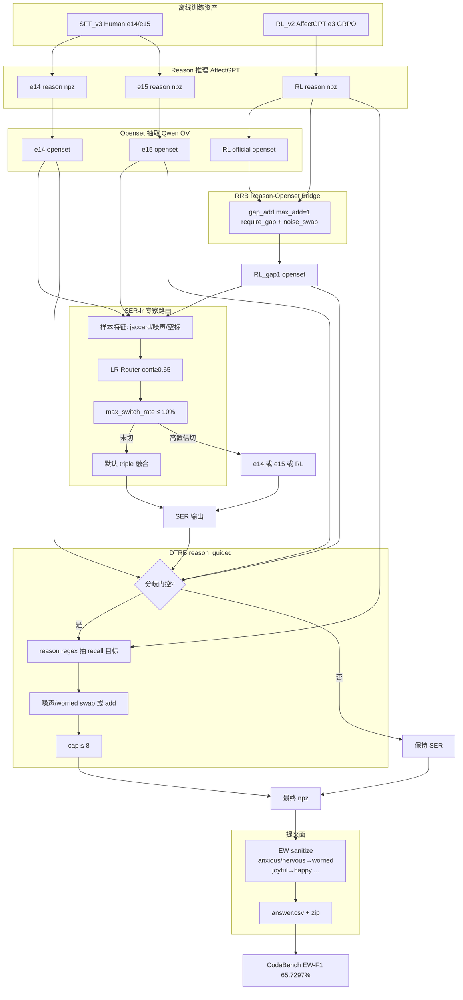
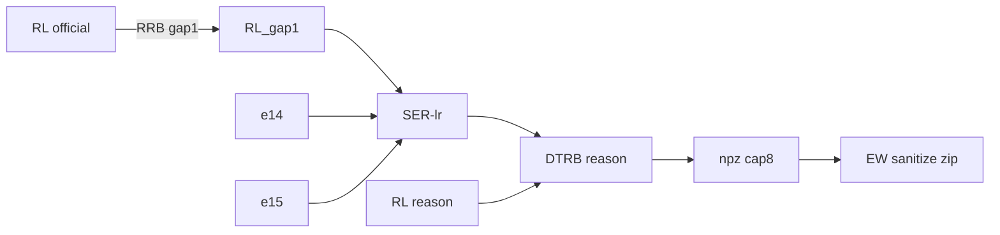

# 当前最优模型：思路与流程图

**变体**：`R3_RL_triple_ser_lr_dtrb_dtrb_reason_cap8`  
**Test EW-F1**：**65.7297%**  
**产物**：
- npz：`outputs/exp021/R3_RL_triple_ser_lr_dtrb_dtrb_reason_cap8_candidate20k.npz`
- zip：`outputs/submissions/R3_RL_triple_ser_lr_dtrb_dtrb_reason_cap8_candidate20k.zip`

**一句话**：三专家（RL gap1 + e14 + e15）经 SER 选择性路由后，用 **reason 引导的 DTRB** 补 recall，最后按 **EW synonym** 打包提交。

---

## 1. 核心思路（给外部读者的完整说明）

### 1.1 任务是什么
本系统参加的是 **MER2026 Track2：开放词汇（open-vocabulary）情感识别**。

- 输入：短视频片段（人脸 / 音频 / 文本等多模态线索）  
- 输出：该片段主角的一组英文情绪词，例如 `[worried, serious, helpless]`  
- 评分：官方把预测词与标注词映射到 Emotion Wheel 后计算 **EW-F1**（下文简称「官方分」）

与「7 类固定情感分类」不同，这里允许任意英文情绪词，但最终会按 wheel 的同义/层级关系做对齐。因此：

- **漏掉关键情绪（recall 不足）** 会掉分；  
- **乱加噪声词（precision 下降）** 也会掉分；  
- 一些看起来「更细」的词（如 `anxious` / `nervous`）与粗词（如 `worried`）在 wheel 上常常等价，**改细标不一定等于涨分**。

候选集规模约 **2 万条**（candidate20k）；本地还有 Human 划分的验证集做消融。我们以 CodaBench 返回的 **test EW-F1** 为最终标准。

### 1.2 基础模型与两段式推理
骨干沿用 AffectGPT / MERTools 体系，推理天然分成两段：

1. **Reason 阶段**：多模态模型生成一段「情绪线索描述」（自然语言）  
2. **Openset 阶段**：再用 LLM（项目中为 Qwen OV 抽取）把 reason **收成情绪词列表**

项目内做过 SFT（监督微调）与 RL（奖励学习，EW-F1 相关 reward）。当前栈用到的关键 checkpoint 是：

| 简称 | 来源 | 角色（直观理解） |
|------|------|------------------|
| **RL e3** | AffectGPT 上 GRPO/RWR 一类强化微调的 epoch3 | 主路预测：较稳、格式规范，但部分高唤醒细标仍偏保守 |
| **SFT e14 / e15** | Human 数据上 SFT 的相邻 epoch | 辅助专家：常能补上 RL 漏掉的标签，但也更爱输出噪声词（如 concerned/confused） |

只交「某一个 checkpoint 的 openset」很快遇到天花板；成绩主要来自 **多个预测之间的可控制融合**，而不是再堆一轮大规模盲目重训。

### 1.3 为什么做成「三专家 + 门控后处理」
观察结论可以概括成三句话：

1. **没有一个专家处处最好**  
   RL 稳但漏标；e14/e15 能补标但更噪。简单取并集（union）会标签膨胀、噪声上升。  
2. **多数样本不该乱动**  
   三路已经接近时，再改标签往往伤 precision。真正有增益的区域，大约是「三路意见不一致」的样本（分歧子集，约占候选的两成量级）。  
3. **要用「证据」补标，而不是全局刷词**  
   更好的信号来自 reason 文本里是否真的出现了相应线索，而不是对所有样本统一加 `nervous` 等词。

因此生产系统不再是「单模型端到端」，而是一条 **多专家流水线**：

> 先得到三路 openset → 谨慎选一路/融合 → 仅在分歧处按 reason 补漏 → 按官方同义规则清洗后提交。

### 1.4 流水线每一层在解决什么问题

**① RRB（Reason–Openset Bridge，gap1）**  
- **问题**：openset 抽取会丢掉 reason 里已经写明的情绪。  
- **做法**：对比 RL 的 reason 与 openset；若存在「reason 有、openset 无」的缺口，**最多补 1 个**标签（可与噪声位交换）。  
- **为什么限制很严**：补多了（gap2、扩大映射）在测试上反而掉分——说明增益来自「准」而不是「多」。

**② SER（Selective Expert Routing，ser_lr）**  
- **问题**：三路何时该融合、何时该信某一个专家？  
- **做法**：用样本特征（三路 Jaccard、RL 是否空、e15 噪声比例等）训练/使用一个线性路由器。  
  - 默认：三路融合（triple）  
  - 仅当路由置信度 ≥ **0.65**，且全局切换比例不超过 **10%** 时，才切到某一专家  
- **直觉**：像「大多数时候用会诊结果，只有模型很有把握时才改听某个专科」。开关打得太松（如 conf=0.60）测试会掉。

**③ DTRB（Divergent Targeted Recall Boost，reason_guided）**  
- **问题**：在分歧样本上，预测常缺 high-arousal / 细粒度标签（焦虑、紧张、惊喜等方向）。  
- **做法**：  
  - 先判断是否「该动」（如三路 Jaccard 低，或 RL 空且 e15 噪声高等）；  
  - 若该动，优先从 **RL reason 文本**用规则抽出 `anxious / joyful / nervous / surprised` 等目标；  
  - 写入时优先 **替换** `concerned / confused / worried` 等噪声，而不是无限追加；总数 **cap=8**。  
- **相对旧版 DTRB 的关键升级**：打开 `reason_guided=True`，补标更跟线索走，而不是只看三路词袋交集。这是相对 65.63 再涨到 **65.73** 的关键一步。

**④ EW sanitize（提交清洗）**  
- **问题**：中间结果里可能同时存在 `anxious` 与 `worried` 等同义词写法。  
- **做法**：提交前按比赛常用的同义表做规范化（如 `anxious/nervous → worried`，`joyful → happy`）。  
- **重要实验结论**：若提交时「故意保留细标、关掉同义映射」，官方分与现生产 **打平**——说明评分侧也会做等价折叠。因此优化必须以 **清洗后的提交字符串** 为准，不能只在中间 npz 上自评「多了多少 nervous」。

### 1.5 设计原则（从踩坑中总结）
1. **融合优于单模硬刷**：成绩靠路由与分歧注入，不靠再训一个「万能」checkpoint。  
2. **默认保守、局部激进**：SER 限制切换率；DTRB 只打分歧样本；RRB 每次最多 +1。  
3. **用 reason 当证据门**：补标要对得上描述，避免词典式灌词。  
4. **以官方提交面为真理**：任何只改变 synonym 轴、在 EW 清洗后不变的改动，对 test 近似无效。  
5. **验证通过不能替代测试**：val 上看起来更好的 SER/参数，多次在 test 上反噬；最终以 CodaBench 为准。

### 1.6 成绩是怎么一步步涨上来的
| 阶段 | 在解决的问题 | 配置要点 | Test EW-F1 |
|------|--------------|----------|------------|
| 三路直接并集 | 多专家有了，但噪声大 | triple union, cap8 | 65.06% |
| +SER | 减少乱融合、学会偶尔信单专家 | ser_lr 0.65 / 10% | 65.46% |
| +DTRB | 在分歧样本上补 recall | 组件池注入 + 换噪声 | 65.63% |
| +RRB-gap1 | 补回 openset 抽丢的 reason 线索 | RL reason→openset 最多+1 | 65.71% |
| **+reason-DTRB（当前生产）** | 让补标更跟 reason 走 | `reason_guided=True` | **65.73%** |

上表对应的变体名形如 `R3_RL_triple_ser_lr_dtrb_*`；当前锁定名为  
`R3_RL_triple_ser_lr_dtrb_dtrb_reason_cap8`。

### 1.7 涨到 65.73% 之后试过什么（为何暂停继续调）
在不引入「新模型权重 / 新训练信号」的前提下，后续大量实验均为 **持平或回退**，例如：

- 双栈融合、nervous 门控注入  
- 提交时关闭 synonym / 提交面手术  
- 对分歧子集用新 prompt 重跑 openset 再并回全栈  

说明当前点已经接近 **「现有三专家 + 门控后处理」的局部最优**。  
再往上需要 **正交新信号**（新 checkpoint、新专家、认真约束的训练等），而不是同一套组件上继续微操。

### 1.8 阅读本文档时可用的名词速查
| 缩写 | 全称含义（本项目语境） |
|------|------------------------|
| EW-F1 | Emotion Wheel 对齐后的 F1，官方主指标 |
| openset | 开放词汇情绪词列表预测 |
| reason | 模型生成的情绪线索文本 |
| RRB | Reason 与 openset 之间的桥接补标 |
| SER | 选择性专家路由 |
| DTRB | 针对分歧样本的 recall 提升模块 |
| cap8 | 每条样本最多保留 8 个情绪词 |

---


## 2. 端到端流程图



---

## 3. 推理期组件数据流（简化）



---

## 4. 关键超参（生产锁定）

| 模块 | 配置 |
|------|------|
| RRB | `mode=gap_add`, `max_add=1`, `require_gap=True`, `allow_noise_swap=True` |
| SER | `ser_lr`, `confidence_threshold=0.65`, `max_switch_rate=0.10` |
| DTRB | `reason_guided=True`, `max_add=2`, `max_labels=8`, `divergent_jaccard=0.5`, `boost_on_noise=False` |
| 提交 | `sanitize_mode=ew`（pipeline synonym） |
| Router | `outputs/exp015/ser_router_model.json` |

---

## 5. 明确不做（已证伪）

- 全量 GRPO_r2 / 标签膨胀式再训  
- SER conf=0.60、扩 RRB（gap2/norm）  
- HDO/WCC 叠在 DTRB 上  
- 提交前关掉 synonym「放出」anxious/nervous（与生产 zip EW 等价，test 打平）  
- 分歧子集 suffix 重解码后再 soft-union 全栈（exp028：65.64 / 65.59）  
- nervous/quorum CPU 洪水  

---

## 6. 复现入口（概要）

组件资产（常见路径）：
- RL gap1：`outputs/exp019/RL_v2_e3_reason_bridge_gap1_candidate20k.npz`
- e14 / e15：`outputs/exp014/SFT_v3_e14|e15_candidate20k.npz`
- 生产栈构建逻辑：见 `scripts/build_exp021_multi_probe_batch.py` 中 `dtrb_reason` 探针

打包：
```bash
python -m src.data.submission_formatter \
  --pred outputs/exp021/R3_RL_triple_ser_lr_dtrb_dtrb_reason_cap8_candidate20k.npz \
  --out outputs/submissions/...csv
# sanitize 默认 ew → zip answer.csv
```

---

## 7. 外部 Reason API 接入（可选）

在 **AffectGPT reason 之后、openset / RRB 之前** 可插入外部大模型改写 reason，不改动生产默认路径。

- 配置：`config/reason_api.yaml`
- 代码：`src/inference/reason_api/`（`OpenAICompatibleReasonAPI` 兼容 DeepSeek / OpenAI / 中转 / vLLM）
- CLI：`scripts/run_reason_api_refine.py`

```bash
export REASON_API_KEY=sk-xxx
export REASON_API_BASE_URL=https://api.deepseek.com   # 或你的中转
export REASON_API_MODEL=deepseek-chat

python scripts/run_reason_api_refine.py \
  --in-reason <affectgpt_reason.npz> \
  --out-reason outputs/reason_api/refined.npz \
  --names-json outputs/exp015/divergent_samples_candidate20k.json
# 随后用 refined.npz 替代原 reason 跑 openset / RRB
```
